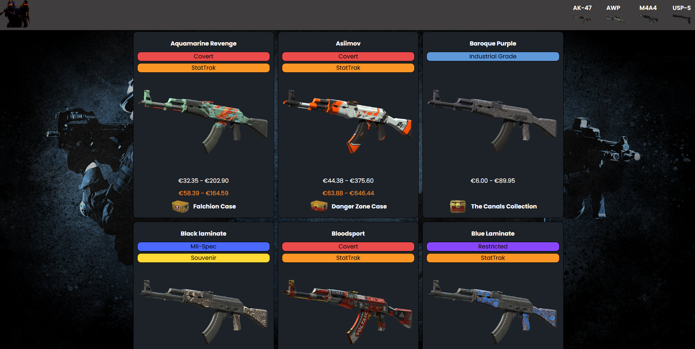
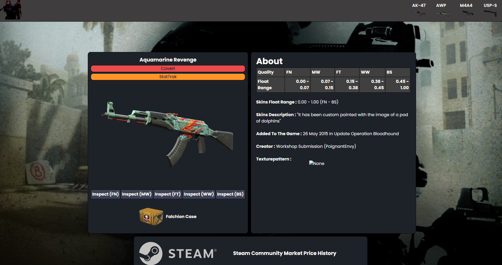
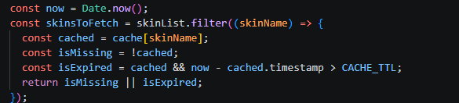

# CS2 Skin Price Tracker

A full-stack web application for tracking CS2 skin prices using
Steam Market data.

## Overview

This project tracks CS2 skin prices and provides historical price
data and analysis through a React frontend and Node.js/Express backend.

## Features

- Steam Market price tracking
- Historical price data
- Price analysis and statistics
- Steam API integration
- Backend caching
- REST API
- React frontend

## Screenshots

### Main Page

### Price Analysis

### Skin Details

## Backend

The backend is built with Node.js and Express and handles
price history requests, caching and communication with Steam Market data.

### Express API

### Cache System

### Steam API Integration

## Technologies

- React
- JavaScript
- Node.js
- Express.js
- Axios
- Steam Market API
